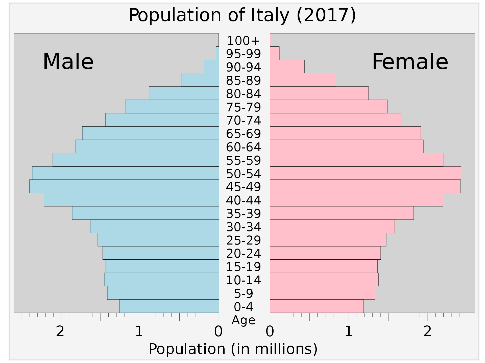
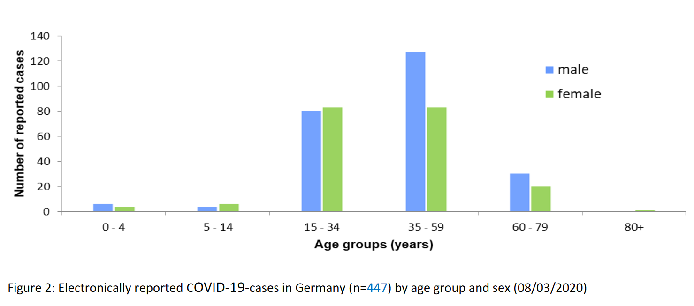
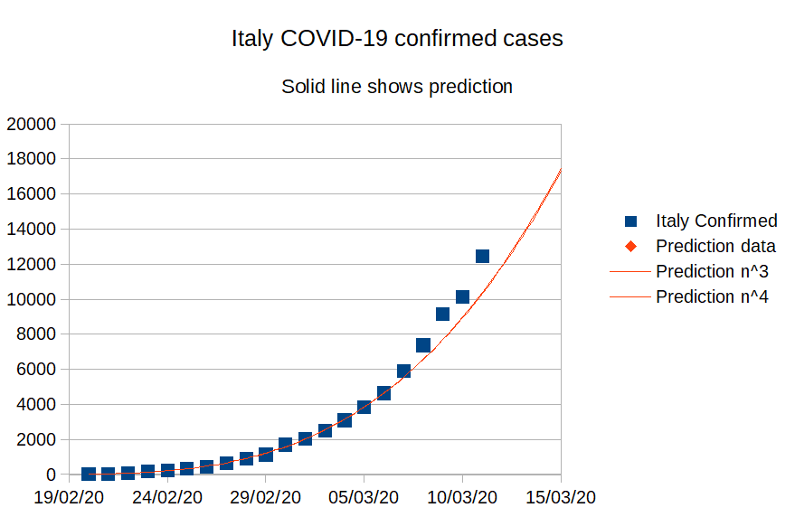
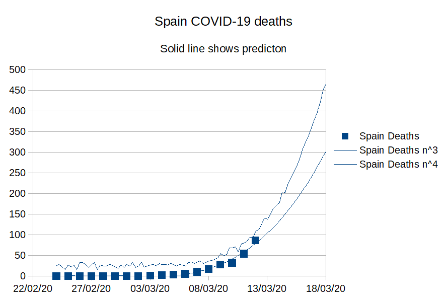

## Will next COVID-19 humanitarian disaster happen in Spain?

It is possible that next COVID-19 humanitarian disaster will happen in Spain. There is not much time left to act. Based on the current projections that it will happen around Wednesday on 18th March 2020.

Please read why this can be true and what immediate actions can be possibly taken to mitigate the likelihood of it happening and how you can personally help and contribute.

### Basis

There exists order of magnitude difference between the COVID-19 related case fatality rate (CFR) in Italy and Germany (during comparable periods 2.5% (now 6%) in Italy and 0.2% in Germany).

Why is there such a big difference?

### Intensive  care beds (ICU)

Italy only has half the number of intensive care beds (ICU) than Germany.

[Source](https://link.springer.com/article/10.1007/s00134-012-2627-8#Tab2)

It is unlikely that this can explain an order of magnitude difference, especially in the beginning of ethe pidemic when health care system is not yet saturated.

### Demographic differences

Itally has been blaming its demographic, but in a country with fewer cases, like Germany, the demographic is almost the same.

[Source](https://en.wikipedia.org/wiki/Demographics_of_Germany)

[Source](https://en.wikipedia.org/wiki/Demographics_of_Italy)

The difference in demographics can not exaplain a difference in mortality by an order of magnitude. There is likely an other cause for this.

### Family structure differences

It is more common that an Italian family has multiple generations live together, while in Germany, most families live in separate households. In addition, Italians are more social. This combined with younger people having milder symptoms or no symptoms at all has likely created such a devastating situation in Italy.

Can there be merit in this hypothesis?

There should be at least visible difference between age groups getting infected in these two countries. Because COVID-19 mortality is order of magnitude higher for older age groups then this can potentially explain the difference.

### Demographic breakdown of confirmed cases

Here is demographic breakdown of confirmed infections in Germany and Italy.

[Source](https://twitter.com/GlennLuk/status/1237904780577722369) (I could not quickly find more official source)

[Source](https://www.rki.de/DE/Content/InfAZ/N/Neuartiges_Coronavirus/Situationsberichte/2020-03-08-en.pdf?__blob=publicationFile)

As you can see, there is huge structural demographic difference between infected people in Italy and in Germany.

In Italy 57.5% infected people are 60 year old or older. 18.3% of people are 80 year old or older. 

In Germany only 14% men in the age group 60-79 and only 10% of women in the same age group. There is very small amount of people (difficult to measure from the graph) that are 80 year old or older. 

### Who else is in risk? Spain!

Where else is the situation similar to Italy?

Spain maybe? Quick googling resulted in these two data points.

80% of Spanish youngsters are still living with their parents ([source](https://english.elpais.com/elpais/2015/12/30/inenglish/1451465661_430238.html).
More and more young Spanish people will be living with their parents until middle age, this is not a phenomenon which will end any time soon ([source](https://spaininsider.blog/2018/08/31/ninis-living-with-their-parents-until-their-40s/)).

This means that Spanish elderly are possibly as much as exposed as the elderly in Italy (it has been difficult to locate demographic breakdown of COVID-19 cases for Spain, please contribute if you have access to it). This combined with even smaller amount of intensive care beds (see the table above) can result in similar catastrophe as we see unrolling in Italy.

### Data and predictions

This table demostrates how rapidly corona virus has spread in Italy. Italy health care system became saturated around 8th March 2020 ([source](https://www.reddit.com/r/medicine/comments/ff8hns/testimony_of_a_surgeon_working_in_bergamo_in_the/)) after what CFR (case fatality rate i.e. total confirmed/total deaths) started to raise.
Date	|	Italy Confirmed	|	Italy Deaths	|	Italy CFR %	|	Prediction Confirmed	|	Prediction Deaths	|
----	|	----	|	----	|	----	|	----	|	----	|
20/02/20	|	3	|		|		|	3	|		|
21/02/20	|	20	|	1	|	5	|	20	|	1	|
22/02/20	|	62	|	2	|	3.23	|	62	|	2	|
23/02/20	|	155	|	3	|	1.94	|	155	|	3	|
24/02/20	|	229	|	7	|	3.06	|	229	|	7	|
25/02/20	|	322	|	10	|	3.11	|	322	|	10	|
26/02/20	|	453	|	12	|	2.65	|	453	|	12	|
27/02/20	|	655	|	17	|	2.6	|	655	|	17	|
28/02/20	|	888	|	21	|	2.36	|	888	|	21	|
29/02/20	|	1129	|	29	|	2.57	|	1129	|	29	|
01/03/20	|	1694	|	34	|	2.01	|	1694	|	34	|
02/03/20	|	2036	|	52	|	2.55	|	2036	|	52	|
03/03/20	|	2502	|	79	|	3.16	|	2502	|	79	|
04/03/20	|	3089	|	107	|	3.46	|		|		|
05/03/20	|	3858	|	148	|	3.84	|		|		|
06/03/20	|	4636	|	197	|	4.25	|		|		|
07/03/20	|	5883	|	233	|	3.96	|		|		|
08/03/20	|	7375	|	366	|	4.96	|		|		|
09/03/20	|	9172	|	463	|	5.05	|		|		|
10/03/20	|	10149	|	631	|	6.22	|		|		|
11/03/20	|	12462	|	827	|	6.64	|		|		|

The following two graphs illustrate the curve such fast growth has and provide in addition two polynomian estimates based on time series. The predictions for confirmed cases are based on the cases up to 3rd March. It demonstrates that the actual growth of the spread was actually faster than the prediction.

This table displays virus development in Spain up to 12th March. CFR is not low but is comparable to the CFR in Italy during comparable time period.

|	Date	|	Spain Confirmed	|	Spain Deaths	|	Spain CFR %	|
|	-----------------	|	---------------------	|	-----------------	|	-----------------	|
|	24/02/20	|	2	|	0	|	0	|
|	25/02/20	|	6	|	0	|	0	|
|	26/02/20	|	13	|	0	|	0	|
|	27/02/20	|	15	|	0	|	0	|
|	28/02/20	|	32	|	0	|	0	|
|	29/02/20	|	45	|	0	|	0	|
|	01/03/20	|	84	|	0	|	0	|
|	02/03/20	|	120	|	0	|	0	|
|	03/03/20	|	165	|	1	|	0.6	|
|	04/03/20	|	222	|	2	|	0.9	|
|	05/03/20	|	259	|	3	|	1.2	|
|	06/03/20	|	400	|	5	|	1.3	|
|	07/03/20	|	500	|	10	|	2	|
|	08/03/20	|	673	|	17	|	2.5	|
|	09/03/20	|	1073	|	28	|	2.6	|
|	10/03/20	|	1695	|	32	|	1.9	|
|	11/03/20	|	2277	|	54	|	2.4	|
|	12/03/20	|	3146	|	86	|	2.7	|

The following two graphs are the main basis for this warning. It can be predicted that Spain reaches 10000 confirmed cases around 18th March and number of total deaths from COVID-19 can reach 450 for this date but can be higher based on the experience in Italy.

### Italy and Spain compared

This table combines the above data and combines it into a single table aligned by the current virus development.

|	Day	|	Date in Spain	|	Spain Confirmed	|	Spain Deaths	|	Spain CFR %	|	Date in Italy	|	Italy Confirmed	|	Italy Deaths	|	Italy CFR %	|
|	-------	|	-------------	|	----------------	|	----------------	|	-------------	|	------------	|	-------------	|	--------------	|	---------	|
|	1	|	24/02/20	|	2	|	0	|	0	|		|		|		|		|
|	2	|	25/02/20	|	6	|	0	|	0	|		|		|		|		|
|	3	|	26/02/20	|	13	|	0	|	0	|		|		|		|		|
|	4	|	27/02/20	|	15	|	0	|	0	|		|		|		|		|
|	5	|	28/02/20	|	32	|	0	|	0	|		|		|		|		|
|	6	|	29/02/20	|	45	|	0	|	0	|	20/02/20	|	3	|		|	0	|
|	7	|	01/03/20	|	84	|	0	|	0	|	21/02/20	|	20	|	1	|	5	|
|	8	|	02/03/20	|	120	|	0	|	0	|	22/02/20	|	62	|	2	|	3.2	|
|	9	|	03/03/20	|	165	|	1	|	0.6	|	23/02/20	|	155	|	3	|	1.9	|
|	10	|	04/03/20	|	222	|	2	|	0.9	|	24/02/20	|	229	|	7	|	3.1	|
|	11	|	05/03/20	|	259	|	3	|	1.2	|	25/02/20	|	322	|	10	|	3.1	|
|	12	|	06/03/20	|	400	|	5	|	1.3	|	26/02/20	|	453	|	12	|	2.6	|
|	13	|	07/03/20	|	500	|	10	|	2	|	27/02/20	|	655	|	17	|	2.6	|
|	14	|	08/03/20	|	673	|	17	|	2.5	|	28/02/20	|	888	|	21	|	2.4	|
|	15	|	09/03/20	|	1073	|	28	|	2.6	|	29/02/20	|	1129	|	29	|	2.6	|
|	16	|	10/03/20	|	1695	|	32	|	1.9	|	01/03/20	|	1694	|	34	|	2	|
|	17	|	11/03/20	|	2277	|	54	|	2.4	|	02/03/20	|	2036	|	52	|	2.6	|
|	18	|	12/03/20	|	3146	|	86	|	2.7	|	03/03/20	|	2502	|	79	|	3.2	|
|	19	|		|		|		|		|	04/03/20	|	3089	|	107	|	3.5	|
|	20	|		|		|		|		|	05/03/20	|	3858	|	148	|	3.8	|
|	21	|		|		|		|		|	06/03/20	|	4636	|	197	|	4.2	|
|	22	|		|		|		|		|	07/03/20	|	5883	|	233	|	4	|
|	23	|		|		|		|		|	08/03/20	|	7375	|	366	|	5	|
|	24	|		|		|		|		|	09/03/20	|	9172	|	463	|	5	|
|	25	|		|		|		|		|	10/03/20	|	10149	|	631	|	6.2	|
|		|		|		|		|		|	11/03/20	|	12462	|	827	|	6.6	|

It can be seen in the following two graphs how likely it is that virus development will follow similar path as in Italy.

### Immediate action is needed!

Spain has at the time of the writting 2277 confirmed cases and 54 deaths (CFR 2.4%). It is comparable to the situation in Italy on 2nd March - 2036 confirmed cases and 52 deaths (CFR 2.6%).

This leaves about 7 days before a similar level will be reached in Spain.

When the health care system exceeds its capacity, it will not be able to handle all critical cases anymore. This is when people will start to die in large numbers as we have learned from Italy. Therefore it is crucial to try to limit the number of infected people as soon as possible.

Please review Julie McMurry, MPH website [https://www.flattenthecurve.com/](https://www.flattenthecurve.com/) to learn more about this problem.

### What can be done?

In the best case scenario, immediate total lock down but not only that. 

All families should isolate their elderly as much as possible limiting physical (but not emotional, because I know social interaction is very important for the Spanish people) contact with their elderly family members to minimum. 

Reasonable sanitary cautions should also be followed; regular hand washing, disinfecting items and food handed over to eldery, etc..

### Why should you believe this or follow these suggestions?

You do not. But there does not appear to exists any better theory that is plausible. There is not enough time to do any deep research and try many other less severe options during the critical period. The time is running out quickly and there is possibility to avoid huge carnage by decisive action.

### How can you help?

Every kind of help is needed!

The campaign needs different contributions. 

It is important to back displayed generalizations with the actual research as much as possible.

This has to be translated into Spanish.

The message must be shared as much as possible and to the highest decision makers as possible. This is crucial.

Please contact me through GitHub or by savespain.covid19@gmail.com to offer your support.
