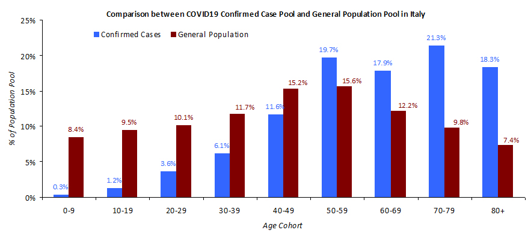

## Will next humanitarian disaster happen in Spain?

I am strongly convinced that next COVID-19 humanitarian disaster will happen in Spain. There is not much time left to act. Based on the current projections it will happen around Wednesday on 18th March 2020.

Please read why I believe this to be true and what immediate actions can be possibly taken to mitigate the likelihood of it happening and you personally can help and contribute.

### Basis

I have been thinking a lot about the difference between the COVID-19 related mortality in Italy and Germany (during comparable periods 2.5% (now 6%) and 0.2%).

How is there so huge difference? 

### Critical care beds (ICU)

Italy has over twice less critical care beds (ICU) than in Germany.

[Source](https://link.springer.com/article/10.1007/s00134-012-2627-8#Tab2)

But I do not believe this can explain an order of magnitude difference. 

### Demographic differences

Italy has blaming its demographic but there is not much difference between Italy and Germany (especially when we compare to India for example).

[Source](https://en.wikipedia.org/wiki/Demographics_of_Germany)

[Source](https://en.wikipedia.org/wiki/Demographics_of_Italy)

[Source](https://www.indexmundi.com/india/age_structure.html)

I do not believe that difference in demographics can explain order of magnitude difference in mortality either. It does not feel likely that cosmetic differences in demographic are amplified into this huge difference in mortality. There should be something else.

### Family structure differences

Today it clicked for me. Of course, for many Italian families multiple generations still live together while in Germany most of the families live in separate households. In addition Italians are more social. This combined with younger people having milder symptoms or no symptoms at all (but still being able to infect) has most likely created this explosive situation in Italy. [citations needed]

Can there be merit in this hypothesis?

There should at least visible difference between age groups getting infected in these two countries. Because COVID-19 mortality is order of magnitude higher for older age groups then this can potentially explain the difference.

### Demographic breakdown of confirmed cases

Here is demographic breakdown of confirmed infections in Germany and Italy.

[Source](https://twitter.com/GlennLuk/status/1237904780577722369) (I could not quickly find more official source)

[Source](https://www.rki.de/DE/Content/InfAZ/N/Neuartiges_Coronavirus/Situationsberichte/2020-03-08-en.pdf?__blob=publicationFile)

As you can see, there is huge structural demographic difference between infected people in Italy and in Germany.

### Who else is in risk? Spain!

This got me thinking. Where else is the situation similar to Italy?

Spain maybe? I am not an expert in this of course but quick googling resulted in these two data points.

80% of Spanish youngsters are still living with their parents https://english.elpais.com/elpais/2015/12/30/inenglish/1451465661_430238.html
More and more young Spanish people will be living with their parents until middle age, this is not a phenomenon which will end any time soon    https://spaininsider.blog/2018/08/31/ninis-living-with-their-parents-until-their-40s/

This means that Spanish elderly are possibly as much as exposed as the elderly in Italy (I have not been able to locate demographic breakdown of COVID-19 cases for Spain). This combined with even smaller amount of critical care beds (see the table above) can result in similar catastrophe as we see unrolling in Italy.

### Immediate action is needed!

Spain has currently 2277 confirmed cases and 54 deaths (CFR 2.4%). It is comparable to the situation in Italy on 2nd March - 2036 confirmed cases and 52 deaths (CFR 2.6%).

This gives about 7 days until Spain will reach the situation similar to Italy (I will include projections later).

When the health care system exceeds its capacity then they could not handle critical cases any more and people start to die in large numbers as we have learned from Italy. Therefore it has utmost importance to try to limit the number of infected people as much as possible.

https://www.flattenthecurve.com/

### What can be done?

In the best case scenario, immediate total lock down but not only that. 

All families should isolate their elderly as much as possible limiting physical (but not emotional, because I know social interaction is very important for the Spanish people) contact with their elderly family members to minimum. 

They should also fallow reasonable sanitary cautions like sanitizing the items and food handed over to elderly, sanitizing sanitary areas that are shared and so on (I believe what ever one could do to limit the possible exposure the better). 

### Why should you believe this or follow these suggestions?

You do not. I am not a domain expert in any of this matter. But I have not seen any better theory that is plausible. There is not much time left to do any deep research and try many other less severe options. Time is running out quickly and there is possibility to avoid huge carnage.

### How can you help?

Every kind of help is needed!

The campaign needs different contributions. 

It is important to back my generalizations with the actual research as much as possible.

This has to be translated into Spanish.

The message must be shared as much as possible and to the highest decision makers as possible. This is crucial.

Please contact me through GitHub or by savespain.covid19@gmail.com to offer your support.
