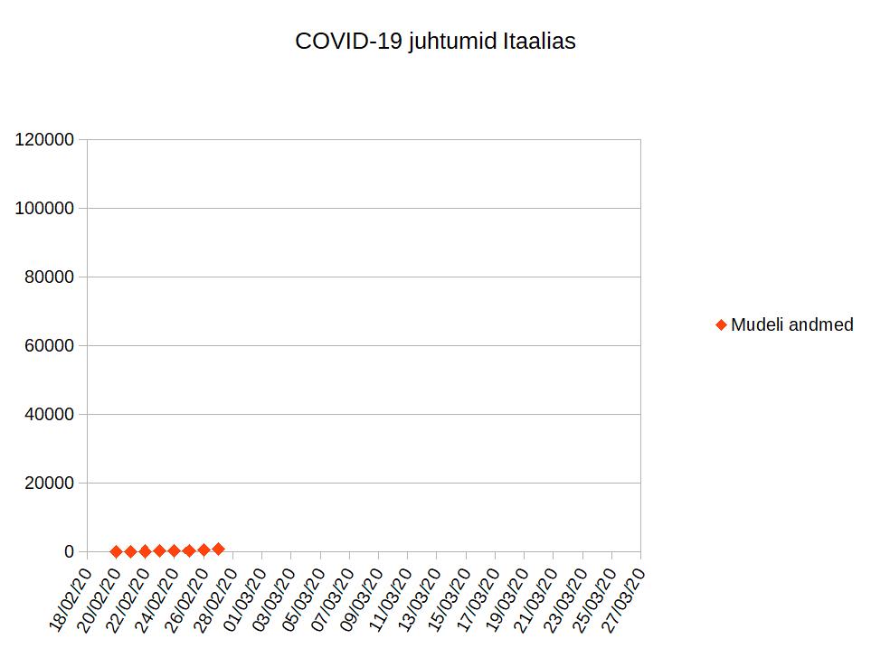
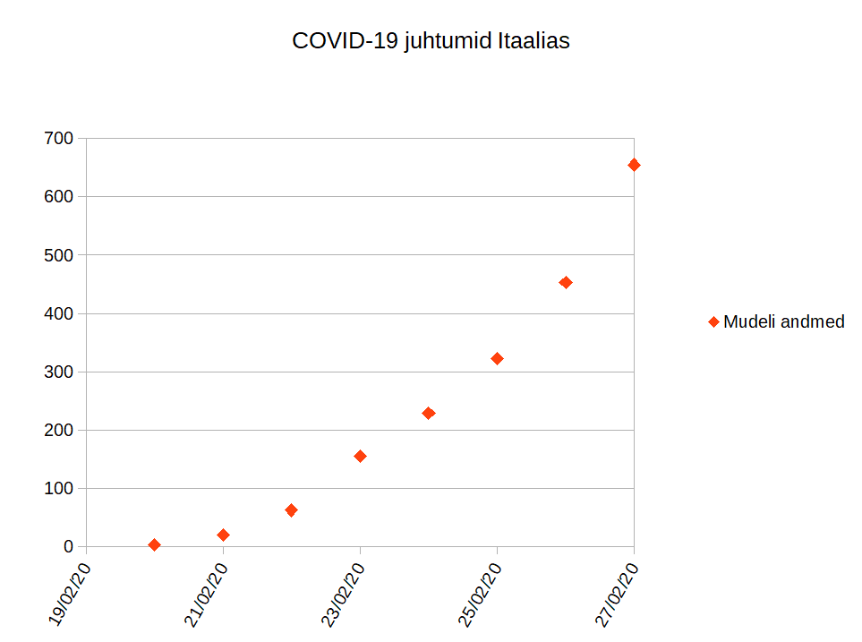
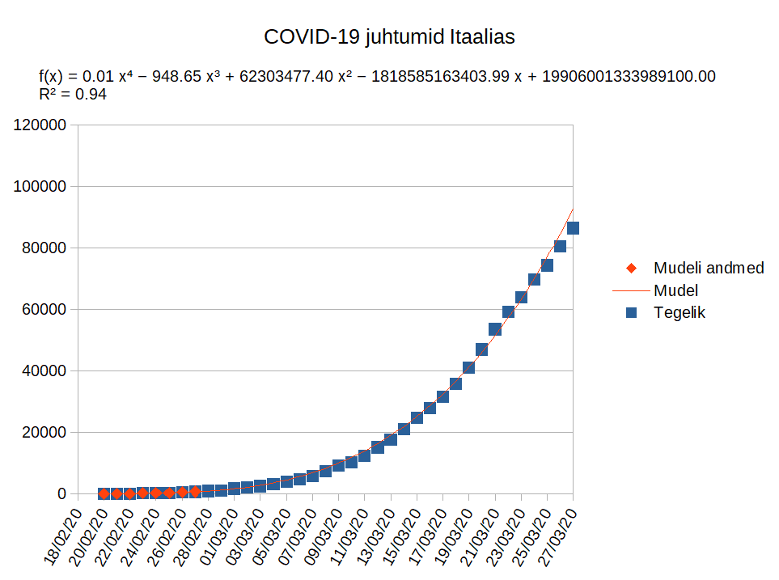
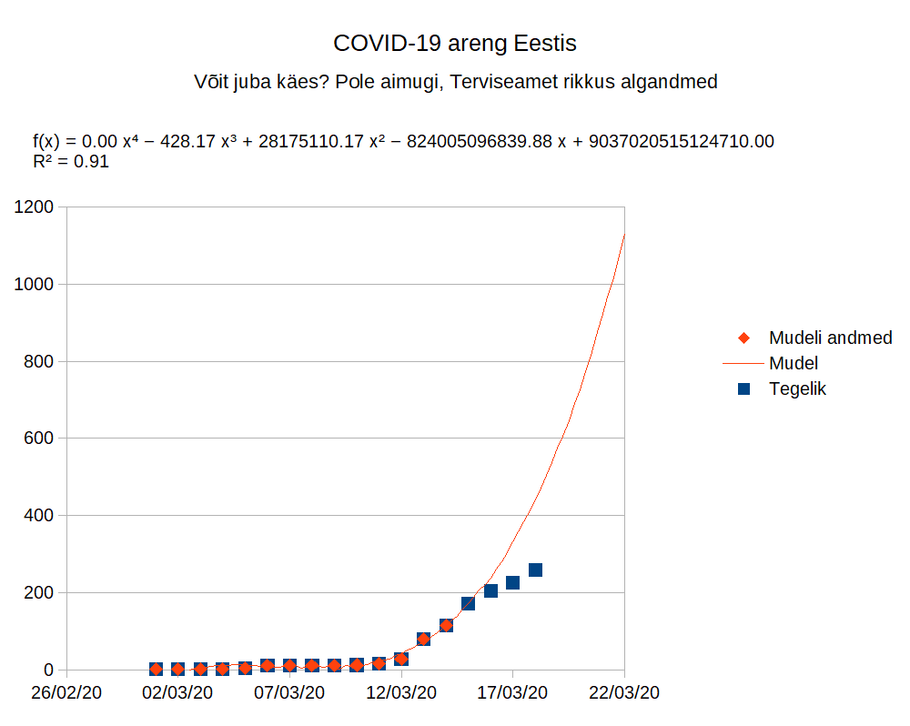
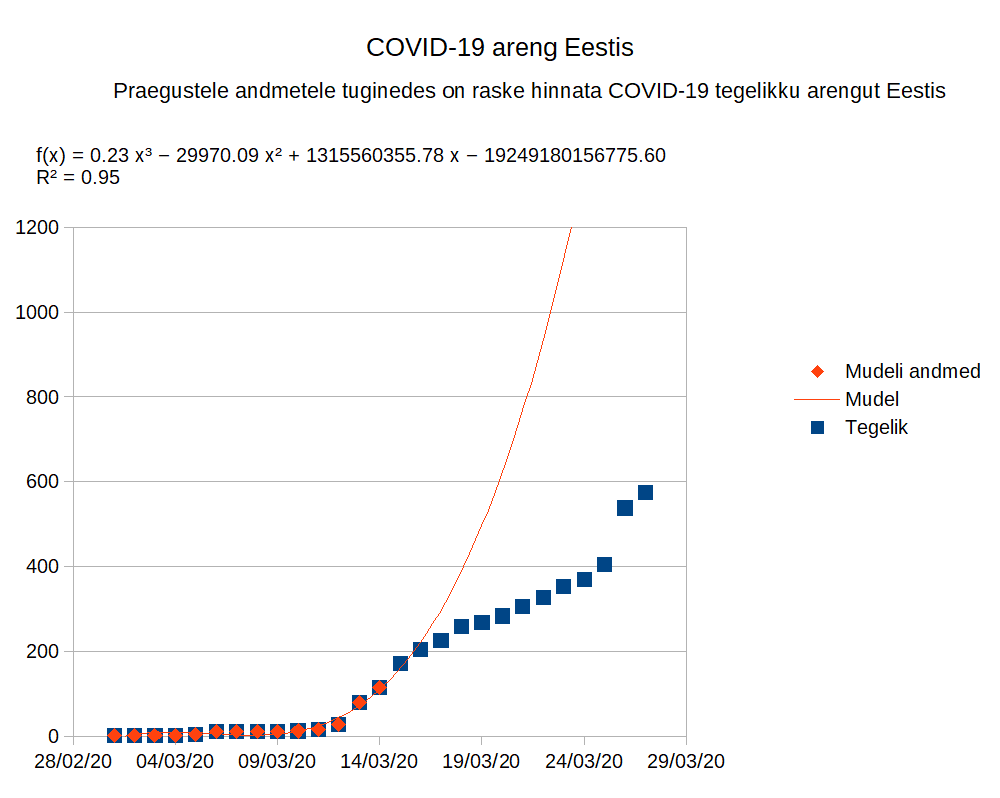

## Testida, testida, testida! Miks seda Eestis ei tehta?

### Heade algandmete jõud

Ma usun, et igaüks teist peaks mind kergelt hulluks, kui ma sellel nädalal täie tõsidusega väidaksin, et tean järgmise nädala loterii võidunumbreid. Itaalia jaoks olid need 27. veebruaril 3, 20, 62, 155, 229, 322, 453 ja 655. Need kaheksa numbrit määrasid Itaalia saatuse. Itaalia oli võitnud COVID-19 jackpoti. 

Meie õnneks ei kulge epideemia areng õnnemängu juhuslikkuse seaduste alusel. Kui meil on hea kvaliteediga andmed, siis on võimalik suure kindlusega ette näha, millises suunas ja millise kiirusega epideemia hakkab liikuma.

Need 8 numbrit, mis on Itaalias kinnitust leidnud SARS-CoV-2 (COVID-19 haigust põhjustav viirus) positiivsete testide arv alates 20. veebruar kuni 27. veebruar, on põhjuseks, miks situatsiooni arengut jälgijad vaatasid õudusega Itaalia tegevusetust parema epideemia kontrolli sisseseadmisel.

Kui me paneme need numbrid graafikusse ja proovime intuitsiooni järgi ennustada haigete arvu 27. märtsil, see tähendab 1 kuu pärast mudeli viimast päeva, siis ei tundu pelgalt peale vaadates, et midagi hullu võiks juhtuda.

Kuid kui me vaatame graafikut lähemalt, siis avaneb pilt, mis paneb iga matemaatikaga natukene sinapeal oleva inimese õudusest kangestuma teades, et see graafik kirjeldab oodatavat kiiret haigusjuhtumite tõusu.

Nende andmete põhjal on võimalik leida trendikõver, mis järgib võimalikult täpselt, kuid mitte liiga täpselt, olemasoleva mudeli andmeid. Nii on võimalik ette aimata epideemia edasist kulgu. 

Tuginedes kogemusele Hiina andmete analüümisel otsustasin kasutada Itaalia puhul 4. astme polünoomi (neile, kelle kokkupuude matemaatikaga jääb kaugele kooliaega, siis 4. astme polünoomi  graafik on sarnane ruutvõrrandi (2. astme polünoomi) graafikule, ainult märgatavalt kiirema tõusuga). 

Mind ennast hämmastab ja samas ka kohutab ainult nende 8 numbri põhjal tehtud mudeli täpsus. See avaldub ilmekalt, kui lisada ennustusele ka tegelik kinnitatud juhtumite arv.

Sellist lihtsat mudelit saab kasutada ka siis, kui ei ole veel täielikku arusaamist viirusest endast. Selle koostamiseks on vaja ainult võimalikult täpseid algandmeid, mida on võimalik kohusetundliku ja põhjaliku testimisega koguda.

Isegi kui see mudel ei suuda ennustada viiruse täpset kulgu ja selle võimalikku kontrolli alla saamise täpset hetke, siis põhjalike algandmete ja mudeli korral on meil võimalik jälgida protsessi kaldumist kõrvale ennustatust. Selle järgi me teame, et Itaalias oli alust 21. märtsil olla ärevuses leviku võimaliku kiirenemise tõttu või 25. märtsil võisid nad lubada veidi lootust, et hakatakse saavutama kontrolli epideemia üle. Järgnevad päevad näitavad, kas tegemist oli ajutise juhusliku kõrvale kaldumisega või on tegemist olulise trendiga.

Ma usaldan täpsemate ennustuste tegemise täpsemate mudelite põhjal oma ala ekspertidele, kuid ka nende töö edukuse aluseks saab olla ainult korrektsete andmete operatiivne kättesaadavus.

Oluline on siin aru saada, et kuigi Itaalias on haigestumisi olnud palju, siis on nende arv olnud prognoositav ja on selgelt võimalik näha, andmetele tuginedes, millal hakatakse epideemia üle kontrolli saavutama. Modelleerimine usaldusväärsete andmete alusel on oluline tööriist epideemia kontrollis.

### Olukord Eestis

Liikudes siit edasi Eesti olukorra juurde ei saa teha muud kui tõdeda, et selles osas ollakse Eestis läbi kukkunud. Kogutud statistika põhjal on raske ennustada COVID-19 epideemia arengu üle Eestis. Sellel on otsesed majanduslikud tagajärjed.

Eestis suudeti vahemikus 12. märts ja 15. märts testida oluliselt laialdast gruppi inimesi, kelle puhul esines COVID-19 kahtlus. Mudel, mille ma koostasin kuni 14. märtsini kogutud andmete põhjal, võimaldas ennustada täpselt positiivsete SARS-CoV-2 testivastuste arvu järgmisel päeval 15. märtsil.

Nende andmete olemasolu oli ideaalne stardipositsioon saamaks aru eriolukorras kehtestatud meetmete tõhususest.

Mis aga tegelikkuses juhtus oli see, et  16. märtsil muudeti testimise protokolli ja asuti testima väikest riskigruppi laiema grupi asemel.

Seda kõike vaatamata sellele, et nii ülikoolid kui ka erasektor olid teinud olulisi pingutusi testimise võime tõstmiseks. [SYNLAB](http://synlab.ee/) oli juba kriisi alguses võimeline tegema 1000 testi päevas. Lisaks teatasid järgneva nädala jooksul ülikoolide laborid, et nad on võimelised tegema 1500 testi päevas. See on ainult esialgne võimekus, mida on võimalik laiendada. Vajalike reagentide tootmine on samuti Eestis olemas Tartu firmas [Solis BioDyne](https://www.solisbiodyne.com/).

Loomulikult kajastus testimise protokolli muutmine koheselt ka andmetes.

WHO juht Tedros Adhanom Ghebreyesus lausus 16. märtsil “We have a simple message for all countries: test, test, test. Test every suspected case.”. 

Mõte on selge, sest nagu autot, ei saa ka kriisi juhtida pimesi.

Tedros Adhanom Ghebreyesus kõnega samal päeval asuti Eestis läbi viima vastupidist programmi vaatamata meie enda ekspertide selgele sõnumile, et testida tuleb võimalikult palju ja põhjalikult.

Tulemuseks on minu arvates katastroof. Meil puudub absoluutselt igasugune põhjendatud operatiivne arusaam epideemia tegelikust arengust Eestis.

Kuigi esmapilgul võib tunduda, et Eestis on tegelikult olemas oluline statistika tänu hospitaliseeritute registreerimisele, siis need andmed laekuvad olulise viitega. Viivitus on 8-9 päeva. Viivitus on siin kahesuunaline. See tähendab, et nii info rakendatud meetmete efektiivsusest avaldub hiljem kui ka pole ka eelinfot haigusjuhtumite võimalikust suurenemisest.

See tähendab, et saamata võimalikult operatiivset tagasisidet, võib valitsus olla sunnitud kehtestama meetmeid, mis oma ranguselt ei vasta tegelikule olukorrale. Need võivad olla kas liialt leebed või liialt ranged. Ühel juhul jääb kontroll epideemia üle saavutamata ja teisel juhul kantakse asjatut majanduskahju.

Samuti on raskendatud meetmete lõdvendamise üle otsustamine. Kui pole operatiivset infot otsustamaks, kas epideemia üle on saavutatud kontroll, siis peab meetmete lõdvendamisega pikemalt viivitama ning kandma sellest tulenevalt suuremat majanduskahju.

Ma olen jõudnud arvamusele, et Eestis kujutatakse testimist ette kui ravivahendit, mis on ainult näidustatud raskete juhtumite korral. Selline arusaam ei suuda näha terviklikku pilti ja ignoreerib  WHO sõnumit. Testimine ei ole ravivahend, see on epideemia kontrolli vahend. Positiivne  SARS-CoV-2 test pole minu arusaamise järgi isegi muutnud kuni lähiajani otsustamist ravi üle, alles järgneva kümne päeva jooksul on selgunud 2 potentsiaalset ravimit, mida võiks kasutada COVID-19 raviks.

Minu veendumuse kohaselt on Eesti suurimaid eksimusi antud kriisis olnud jätta kontroll testimise protokolli üle ametnike ja mitte oma ala ekspertide kätte.

## Kuidas antud olukorrast edasi liikuda? 

Ma arvan, et esmalt tuleks meie otsustajatel võtta sellel kiirel ajal väike mõttepaus ning mõelda selle üle, et kas need inimesed, kes on meid kõiki sellisel määral alt vedanud, suudavad edaspidi võtta  vastu meile kasulikke olulisi otsuseid. Minul see usaldus puudub, aga võib-olla pole Eestil antud olukorras palju alternatiive.

Teine oluline küsimus, mis tuleb kiirkorras lahendada, on testimise strateegia. Kontroll selle üle tuleb anda nende oma ala ekspertide kätte, kes tegelevad sisulise epideemia kontrolliga.

Testimist tuleb reaalselt rakendada epideemia kontrolliks, nagu on seda tehtud Lõuna-Koreas ja mis on võimaldanud neil väiksemate majanduskahjudega saavutada kontrolli epideemia üle (kuigi see kontroll pole hetkel lõplik, nagu tundub olevat äärmuseni rangeid meetmeid kasutanud Hiina puhul). 

Lisaks tuleb läbi töötada juba kogutud andmed ja nendest eraldada kasutatav osa. Näiteks selgelt ühesuguste haigustunnustega nakatunute hulk. See võimaldaks edaspidises analüüsis lähtuda ka juba kogutud andmetest.

Samuti on väga oluline omada operatiivset ülevaadet erinevate vanusegruppide nakatumisest. Selle põhjal saab operatiivselt hinnata juba lähiajal haiglaravi vajavate inimeste hulka. Eestis on hetkeseisuga nakatunuid 60 aastaste ja vanemate hulgas 18%. Kui see arv tõuseb oluliselt, siis kasvab ka oluliselt koormus intensiivravivõimele.

On äärmiselt oluline saada aru põhiliste riskigruppide isoleerimise vajadusest. Kui viirus nendeni ei jõua, siis on raskete juhtumite arv suurusjärgu võrra väiksem. Seda näitab teiste riikide kogemus.