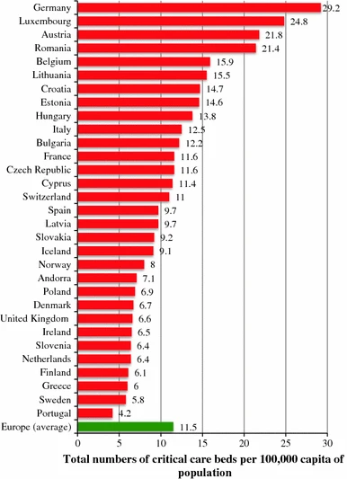
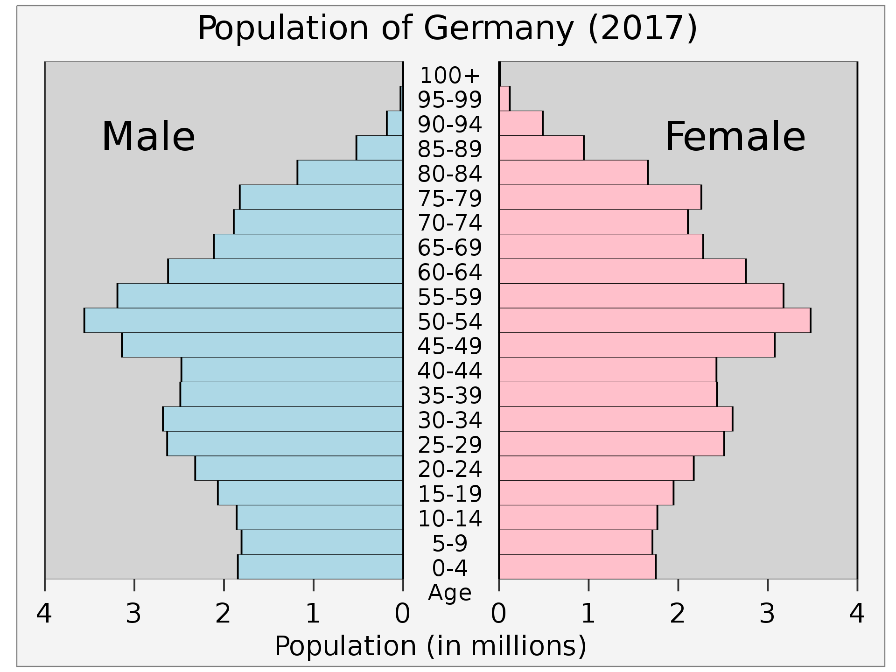
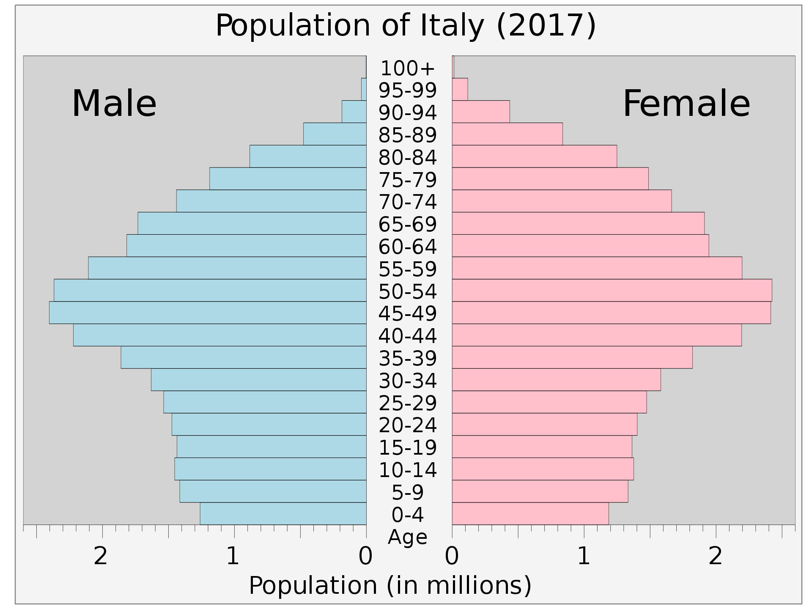
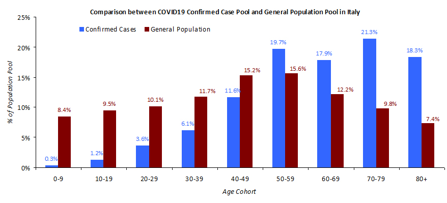
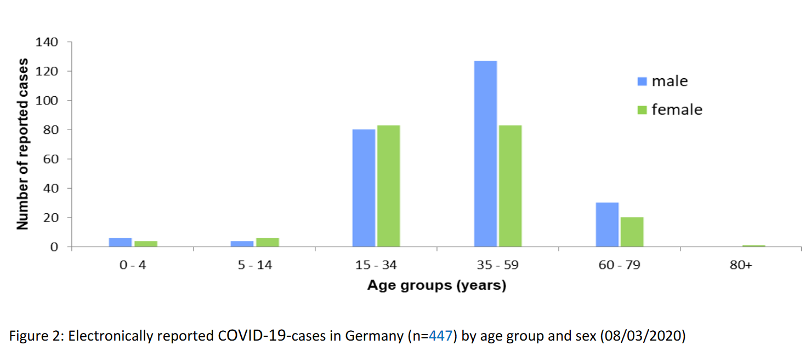

## Why is there such a big difference in Italy and Germany COVID-19 case fatality rate?

There exists order of magnitude difference between the COVID-19 related case fatality rate (CFR) in Italy and Germany (during comparable periods 2.5% (now 6%) in Italy and 0.2% in Germany).

Why is there such a big difference?

### Intensive  care beds (ICU)

Italy only has half the number of intensive care beds (ICU) than Germany.

[Source](https://link.springer.com/article/10.1007/s00134-012-2627-8#Tab2)

It is unlikely that this can explain an order of magnitude difference, especially in the beginning of the epidemic when health care system is not yet saturated.

### Demographic differences

Itally has been blaming its demographic, but in a country with fewer deaths, like Germany, the demographic is almost the same.

[Source](https://en.wikipedia.org/wiki/Demographics_of_Germany)

[Source](https://en.wikipedia.org/wiki/Demographics_of_Italy)

The difference in demographics can not exaplain a difference in mortality by an order of magnitude. There is likely an other cause for this.

### Family structure differences

It is more common that an Italian family has multiple generations live together, while in Germany, most families live in separate households. In addition, Italians are more social. This combined with younger people having milder symptoms or no symptoms at all has likely created such a devastating situation in Italy.

Can there be merit in this hypothesis?

There should be at least visible difference between age groups getting infected in these two countries. Because COVID-19 mortality is order of magnitude higher for older age groups then this can potentially explain the difference.

### Demographic breakdown of confirmed cases

Here is demographic breakdown of confirmed infections in Germany and Italy.

[Source](https://twitter.com/GlennLuk/status/1237904780577722369) (I could not quickly find more official source)

[Source](https://www.rki.de/DE/Content/InfAZ/N/Neuartiges_Coronavirus/Situationsberichte/2020-03-08-en.pdf?__blob=publicationFile)

As you can see, there is huge structural demographic difference between infected people in Italy and in Germany.

In Italy 57.5% infected people are 60 year old or older. 18.3% of people are 80 year old or older. 

In Germany only 14% men in the age group 60-79 and only 10% of women in the same age group. There is very small amount of people (difficult to measure from the graph) that are 80 year old or older. 

### Conclusions

It is important when assuming this hypothesis to be true to drastically limit people who are 60 year old or older to get infected by the corona virus.

All families should isolate their elderly as much as possible limiting physical (but not emotional because social interaction is very important to maintain the quality of life) contact with their elderly family members to minimum. 

Reasonable sanitary cautions should also be followed; regular hand washing, disinfecting items and food handed over to elderly, etc.
